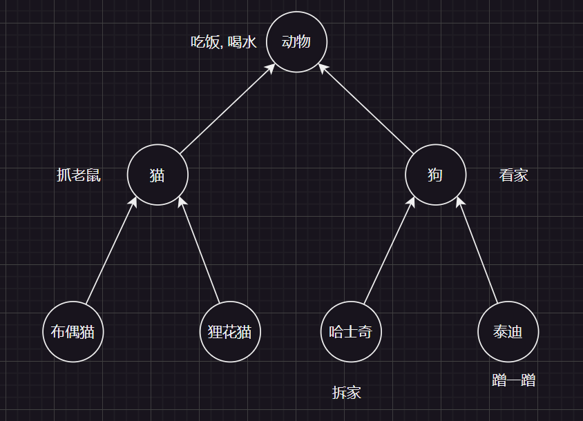

## 封装

对象代表什么, 就得封装对应的数据, 并提供数据对应的行为(方法)

封装告诉我们如何正确的使用对象

---

## 继承

Java中提供了一个关键字`extends`, 用这个关键字可以让一个类和另一个类建立关系

Java只支持单继承, 不支持多继承, 但支持多层继承.

:::details
Java中的类都直接或者间接的继承`Object`类
:::

使用继承的好处

1. 可以把多个子类中重复的代码抽取到父类中, 提高代码的复用性
2. 子类可以在父类的基础上, 增加其他的功能, 使子类更加强大

基本形式: `public class Student extends Person {}`

什么时候使用继承

当类与类之间, **存在相同的内容**, 并**满足子类是父类中的一种**, 就可以考虑使用继承, 来优化代码

---

### 如何正确设计继承

**画图法**(从下往上) ==> 下面为子类, 上面为父类. 需要把子类中的共性内容抽取到父类中

书写代码: 从上往下写(因为父类都没有就无法继承)



---

### 子类到底能继承父类中的那些内容

| 继承 | 是否可继承 | 是否可继承 |
| ------------- | :-----------: | ----: |
| 构造方法     | 非私有 不能 | private 不能 |
| 成员变量     | 非私有 能 | private 可以 |
| 成员方法     | **虚方法表** 能 | 否则 不能 |

:::tip
构造方法无法继承下来, 如果能够继承下来就违背了**类名与构造方法名一致**

成员变量的私有和非私有, 虽然继承了下来, 但经过`private`修饰的变量, 是无法访问的, 当可以通过对应的`getter`和`setter`访问.
:::

:::details 虚方法表
虚方法表特征: `非private`, `非final`, `非static`

虚方法表`vtable`会从父类继承而来, 当子类调用某个方法时, 会查看虚方法表, 而不是直接查看父类, 以及父类的父类.
如果虚方法表中没有调用的方法, 会在本类中查找. 如果还没有就会去查找父类.
:::

:::code-group
```java [Animal]
public class Animal {
    public void drink() {
        System.out.println("喝水");
    }
    //权限修饰符:
    //private : 子类就无法访问
    //私有: 除了本类外不可以访问

    //注意事项:
    //子类只能访问父类中非私有的成员
    private void eat() { // [!code highlight]
        System.out.println("吃饭");
    }
}
```

```java [Cat]
public class Cat extends Animal {
    public void grabMouse() {
        System.out.println("抓老鼠");
    }

}
```

```java [DollCat]
public class DollCat extends Cat {

}

```

```java [Test]
public class Test {
    public static void main(String[] args) {
        DollCat dollCat = new DollCat();
        //代码错误eat方法为私有, 子类无法访问
        dollCat.eat();// [!code error]
        dollCat.drink();
        dollCat.grabMouse();
    }
}
```
:::

---

### super

:::code-group
```java [情况一]
public class Father {
    String name = "爹";// super.name
}

class Son extends Father{
    String name = "儿子";//this.name

    public void  ziShow() {
        String name = "zishow";
        System.out.println(name);//从局部位置开始往上找
        System.out.println(this.name);//从本类成员位置往上找
        System.out.println(super.name);//从父类成员位置往上找

    }
}
```

```java [情况二]
class Father {
    String name = "爹";
}

class Son extends Father {

    public void ziShow1() {
        //本类成员没有则向上找, 到父类中寻找
        System.out.println(this.name);// 爹
        
    }
}
```
:::

:::details 就近原则查找机制
查看变量的就近原则方法. 先在局部找, 本类成员位置找, 父类成员位置找, 逐级往上

| 方式 | 说明 |
| ------------- | :-----------: |
| `xxx`      | 从局部位置开始往上找 |
| `this.xxx`      | 从本类成员位置往上找 |
| `super.xxx`      | 从父类成员位置往上找 |
:::

---

### 构造方法访问特点

- 父类中的构造方法不会被子类继承
- 子类中的构造方法会默认调用先访问父类中的无参构造方法, 再执行自己

:::tip
1. 子类在初始化的时候, 有可能会使用到父类的数据, 如果父类没有完成初始化, 子类将无法使用父类的数据
2. 子类在初始化之前, 一定要调用父类的构造方法, 就是为了先完成父类数据的初始化
3. 子类若需要调用父类的构造方法, 必须在**子类构造方法**的**第一行**使用`super()`调用, 不写也存在.
:::

### 调用父类的无参构造

:::code-group
```java [Person]
public class Person {
    String name;
    int age;

    public Person() {
        System.out.println("父类的无参构造");
    }

    public Person(String name, int age) {
        this.name = name;
        this.age = age;
    }
}
```

```java [Student]
public class Student extends Person {

    public Student() {
        //使用错误, super()必须在第一行
        System.out.println("111"); // [!code error]
        //子类构造方法中隐藏着super()
        super();
        System.out.println("子类的无参构造");// [!code ++]
    }
}
```

```java [Test]
public class Test {
    public static void main(String[] args) {
        Student stu = new Student();
        /*
            最终输出结果为: 

            父类的无参构造
            子类的无参构造
        */
    }
}

```
:::

---

### 调用父类的带参构造

:::code-group
```java [Person]
public class Person {
    String name;
    int age;

    public Person() {
        System.out.println("父类的无参构造");
    }

    public Person(String name, int age) {
        this.name = name;
        this.age = age;
    }
}
```

```java [Student]
public class Student extends Person {

    public Student() {
        //子类构造方法中隐藏着super()
        super();
    }

    public Student(String name, int age) {
        //将参数传递给父类的带参构造
        super(name, age);// [!code highlight]
    }
}
```

```java [Test]
public class Test {
    public static void main(String[] args) {
        Student stu = new Student("张三", 23);
        // stu: name = 张三, age = 23
    }
}
```
:::

:::details
- 子类不能继承父类的构造方法, 但可以通过`super`调用
- 子类的构造方法的第一行, 有一个默认的`super`
- 默认先访问父类的无参构造方法, 再执行自己的构造方法
- 如果想要方法调用父类的有参构造, 必须手动添加`super(参数)`
:::

---

### this和super的使用总结

- `this`: 理解为一个变量, 表示当前方法调用者的地址值

:::code-group
```java [Student]
public class Student {
    String name;
    int age;

    public void show(Student this) {
        System.out.println(this.name + this.age);
    }

}
```

```java [Test]
public class Test {
    public static void main(String[] args) {
        Student stu = new Student();
        //调用者为stu, 所以虚拟机在内部将stu的地址值传递给了show方法
        stu.show();
    }
}
```
:::

---

- `super`: 代表父类的存储空间

| 关键字 | 访问成员变量 | 访问成员方法 | 访问构造方法 |
| ------------- | :-----------: | :-----------: | ----: |
| `this`      | `this.成员变量`访问本类的成员变量 | `this.成员方法`访问本类的成员方法 | `this(...)`调用本类其他的构造方法 |
| `super`      |  `super.成员变量`访问父类的成员变量 | `super.成员方法`访问父类的成员方法 | `super(...)`调用父类的构造方法 |

:::details 解释this()
```java
public class Student {
    private String name;
    private int age;
    private char gender;

    public Student() {
        //若变量没有赋值, 可以添加默认值
        //this(...)调用本类其他的构造方法
        //细节: 虚拟机就不会调用super(), 因为其他的构造方法内部有着super(), super()只调用一次就可以了
        this(null, 0, '男');// [!code highlight]
    }

    public Student(String name, int age, char gender) {
        super();// [!code highlight]
        this.name = name;
        this.age = age;
        this.gender = gender;
    }
}
```

> 1. `this(...)`和`super(...)`只能在构造方法的第一行使用
> 2. 调用`this(...)`之后, 虚拟机就不会在当前构造方法中调用`super()`了, 因为其他的构造方法内部有着super(), super()只调用一次就可以了
> 3. 使用场景: 为一些数据赋默认值的时候会使用
:::

---

## 多态

- 多态: 同类型的对象, 表现出的不同形态 ===> 对象的多种形态

1. 多态的表现形式

`父类类型 对象名称 = 子类对象;`

2. 多态的前提
   1. 有继承关系
   2. 有父类引用指向子类对象 ==> `Fu f = new Zi();`
   3. 有方法的重写

3. 多态的好处
   - 使用父类类型作为参数, 可以接收任意子类对象, 提高代码的扩展性

基本使用

:::code-group
```java [Person]
public class Person {
    private String name;
    private int age;

    public Person() {
    }

    public Person(String name, int age) {
        this.name = name;
        this.age = age;
    }

    public String getName() {
        return name;
    }

    public void setName(String name) {
        this.name = name;
    }

    public int getAge() {
        return age;
    }

    public void setAge(int age) {
        this.age = age;
    }

    public void show() {
        System.out.println("人的信息" + getName() + ", " + getAge());
    }
    
}
```

```java [Manager]
public class Manager extends Person {
    @Override
    public void show() {
        System.out.println("管理员的信息" + getName() + ", " + getAge());
    }
}
```

```java [Student]
public class Student extends Person {
    @Override
    public void show() {
        System.out.println("学生的信息" + getName() + ", " + getAge());
    }
}
```

```java [Administrator]
public class Administrator extends Person{
    @Override
    public void show() {
        System.out.println("管理员的信息" + getName() + ", " + getAge());
    }
}
```

```java [Test]
public class Test {
    public static void main(String[] args) {
        Student s = new Student();
        s.setAge(18);
        s.setName("wjn");

        Manager m = new Manager();
        m.setAge(30);
        m.setName("lzw");

        Administrator admin = new Administrator();
        admin.setAge(31);
        admin.setName("ddw");

        register(s);
        register(m);
        register(admin);
    }

    public static void register(Person p) {
        p.show();
    }
}
```
:::

:::tip
如果没有多态, 那么每一个类型对想要设计一个函数, 例如: `Administrator`类型需要设计一个`register`函数, `Student`类型也需要设计一个`register`函数, 这样代码的冗余度太高了. 而多态的存在, 可以让`register(Person p)`函数接收任何`Person`的子类对象, 提高代码的扩展性
:::

---

### 多态调用成员的特点

1. 成员变量: 编译看左边, 运行看左边
2. 成员方法: 编译看左边, 运行看右边

```java
public class Test {
    public static void main(String[] args) {
        //左侧类型可以接收任何它的子类对象
        Animal a = new Dog();
        //调用成员变量注意点, 成员变量: 编译看左边, 运行看左边
        //编译看左边指的是在编译的时候会查看左边的类型Animal是否存在name属性
        //编译看右边也是一样, 会查看左边的类型Animal是否存在name属性
        //如果左边的类型Animal没有name属性会直接报错
        //注: 若左边的类型没有name属性, 并不会查找其子类存在name属性
        System.out.println(a.name);//动物
    }
}

class Animal {
    //如果name属性不存在, 则上述使用会报错
    String name = "动物";// [!code warning]
    public void eat() {
        System.out.println("吃");
    }
}

class Dog extends Animal {
    String name = "狗";
    @Override
    public void eat() {
        System.out.println("吃狗粮");
    }
}
```

:::tip
1. 调用成员变量: 编译看左边, 运行看左边.`Animal a = new Dog();`
   - 编译看左边: `javac`编译代码的时候, 会看左边的父类中又没有这个变量, 如果有就编译通过, 如果没有就编译失败
   - 运行看左边: `java`运行代码的时候, 实际获取的是*左边父类的成员变量值*.
2. 调用成员方法: 编译看左边, 运行看右边
   - 编译看左边: `javac`编译代码的时候, 会看左边的父类中有没有这个方法, 如果有就编译通过, 如果没有就编译失败
   - 运行看右边: `java`运行代码的时候, 实际调用的是*右边子类重写的方法*.
:::

---

### 多态的弊端以及解决方案

1. **多态的弊端: 无法使用子类特有的功能**

```java
public class Test {
    public static void main(String[] args) {
        //左侧类型可以接收任何它的子类对象
        //自动类型转换
        Animal a = new Dog();
        //报错, 因为a没有lookHome方法
        a.lookHome();// [!code error]
    }
}

class Animal {
    String name = "动物";
    public void eat() {
        System.out.println("吃");
    }
}

class Dog extends Animal {
    String name = "狗";
    @Override
    public void eat() {
        System.out.println("吃狗粮");
    }
    public void lookHome() {
        System.out.println("看家");
    }
}

class Cat extends Animal {
    String name = "猫";
    @Override
    public void eat() {
        System.out.println("吃猫粮");
    }
    public void catchMouse() {
        System.out.println("抓猫");
    }
}
```

解决方案: 使用强制类型转换

```java
public class Test {
    public static void main(String[] args) {
        Animal a = new Dog();
        //强制类型转换为Dog类型
        Dog d = (Dog) a;
        d.lookHome();
    }
}
```

:::details 随便强转带来的后果
```java
public class Test {
    public static void main(String[] args) {
        Animal a = new Dog();
        //强制类型转换为Cat类型, 在语法上不好报错, 但是在运行时会报错
        Cat c = (Cat) a;
        c.catchMouse();
    }
}
```

:::danger 报错
Exception in thread "main" java.lang.ClassCastException: class Dog cannot be cast to class Cat (Dog and Cat are in unnamed module of loader 'app') at Test.main(Test.java:12)

:::


> 那么随之带来的问题是, 我如何知道`a`对象到底是不是`Dog`类型呢? 如何`Animal a = new Dog();`是其他人写的代码, 我如何知道`a`对象到底是不是`Dog`类型呢? 这时就需要使用`instanceof`关键字

---

### instanceof

基本形式: `a instanceof Dog` ==> a的类型是否是`Dog`

:::code-group
```java [JDK14以前]
public class Test {
    public static void main(String[] args) {
        Animal a = new Dog();
        if(a instanceof Dog) {
            Dog d = (Dog) a;
            d.lookHome();
        } else if(a instanceof Cat) {
            Cat c = (Cat) a;
            c.catchMouse();
        }
    }
}
```

```java [JDK14以后]
public class Test {
    public static void main(String[] args) {
        Animal a = new Dog();
        //若a为Dog类型, 则会将a强制转换为Dog类型并赋值给d
        if(a instanceof Dog d) {
            d.lookHome();
        } else if(a instanceof Cat c) {
            c.catchMouse();
        }
    }
}
```
:::

