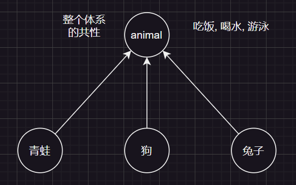
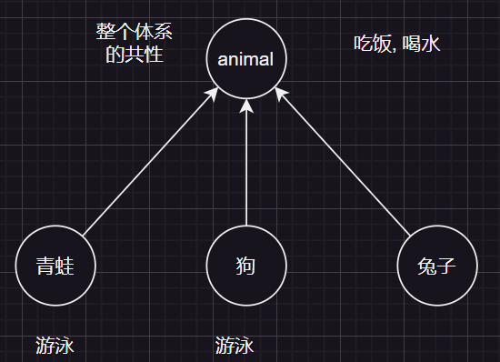
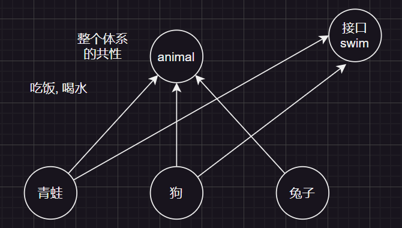

## 为什么有接口



父类需要提取整个体系中的共性, 但并不是每一个动物都会**游泳**, 例如: 兔子. 

那么可能想到的解决方案**是青蛙和狗各种写一个游泳方法**.



如果青蛙类和狗类不是自己写的, 那么写青蛙类的人会认为游泳是一个方法, 那肯定是`swim`啊;
写狗类的人认为游泳, 那肯定写`swimming`啊

这就会出现分歧, 也就可以引出接口的作用.
**接口的作用就是指定方法的规则. 如果多个类需要指定和使用某个方法就需要遵守接口的规则**



## 抽象类与接口的区别

抽象类使用在父类中, 在抽取共性方法中, 方法体不确定该写什么, 就可以写成抽象方法, 而抽象方法所在的类就是抽象类.

父类作为抽象类, 需要提取共性方法, 而这些共性方法**必须适用于所有子类**. 如果一个方法`swim`只适用于部分子类, 那么就可以为方法使用接口定义规则. 当一个方法只适用于一个类时, 例如: 看家, 那么就可以把此方法写成普通的方法

---

## 接口的定义和使用

- 接口用`interface`来定义 ==> `public interface 接口名 {}`
- 接口不能实例化
- 接口和类之间是实现关系, 通过`implements`关键字表示 ==> `public class 类名 implements 接口名 {}`
- 接口的子类
  - 要么重写接口中的所有抽象方法
  - 要么是抽象类(了解一下)

:::tip 注意
1. 接口和类的实现关系, 可以单实现, 也可以多实现. 多实现用逗号隔开
`public class 类名 implements 接口名1, 接口名2,... {}`

2. 实现类还可以在继承一个类的同时实现多个接口
`public class 类名 extends 父类 implements 接口名1, 接口名2,... {}`
:::

---

## 接口中成员的特点

- 成员变量
  - 只能是变量
  - 默认修饰符为: `public static final`
- 构造方法
  - 没有
- 成员方法
  - 只能是抽象方法
  - 默认修饰符为: `public abstract`

> `JDK7`以前接口中只能定义抽象方法

---

## 实现类实现多个接口的重名问题

一个实现类继承多个接口, 那么多个接口中如果出现重名方法, 最终只需要实现一个即可

:::code-group
```java [Inter]
public interface Inter {
    public abstract void method1();
    public abstract void method2();
    public abstract void method3();
}
```

```java [Inter2]
public interface Inter2 {
    public abstract void method1();
    public abstract void method2();
    public abstract void method3();
    public abstract void method4();
}
```

```java [InterImpl]
public class InterImpl implements Inter, Inter2 {
    //重名的接口只需要实现一个即可
    @Override
    public void method1() {

    }

    @Override
    public void method2() {

    }

    @Override
    public void method3() {

    }

    @Override
    public void method4() {

    }
}
```
:::

---

## 接口与接口的继承关系

接口与接口之间, 可以单继承, 也可以多继承.

> 细节: 如果实现类实现了最下面的子接口, 需要重写所以的抽象方法

:::code-group
```java [Inter1]
public interface Inter1 {
    //接口与接口之间, 可以单继承, 也可以多继承
    //细节: 如果实现类实现了最下面的子接口, 需要重写所以的抽象方法
    public abstract void method1();
}
```

```java [Inter2]
public interface Inter2 {
    public abstract void methods2();
}
```

```java [Inter3]
public interface Inter3 extends Inter1, Inter2 {
    public abstract void method3();
}

```

```java [InterImpl]
public class InterImpl implements Inter3 {
    @Override
    public void method3() {

    }

    @Override
    public void method1() {

    }

    @Override
    public void methods2() {

    }
}
```
:::

---

## 接口中的默认方法

`JDK8`以后, 接口可以定义**默认方法**, 默认方法有方法体, 可以直接使用

作用: 解决接口升级(即接口新增规则)的问题

为什么`JDK`要要新增默认方法?

在团队协作中, 新加一个接口方法, 那么实现类都需要重写新加的这个方法, 而编写实现类的人, 可能有着其他事要忙, 这时候就会非常麻烦. 这就时候, 就需要默认方法, 就添加了方法, 又不会报错, 等时机恰当就可以把方法修改为抽象方法.

---

接口中默认方法的定义格式

- 格式: `public default 返回值类型 方法名(参数列表) {...}`
- 范式: `public default void show() {...}`

:::tip 注意事项
- 默认方法不是抽象方法, 所以不强制重写. 如果重写默认方法, 则不需要加上`default`关键字
- `public`可以省略, 但`default`不可以省略
- 如果实现了多个接口,多个接口中存在相同名字的默认方法, **子类就必须对该方法进行重写**
:::

:::code-group
```java [Inter1]
public interface Inter1 {
    public abstract void method();
    //1. 默认方法重写是可选的
    public default void show() {// [!code highlight]
        System.out.println("show");
    }
    //2. `public`可以省略, 但`default`不可以省略. 此方法会被视为抽象方法, 而抽象方法没有方法体
    void show2() {}// [!code error]
}
```

```java [InterImpl]
public class InterImpl implements Inter1 {
    @Override
    public void method() {
        System.out.println("方法1");
    }
    //1. show方法重写是可选的 // [!code highlight]

    //1. 如果重写默认方法, 则不需要加上default关键字
    @Override
    public void show() {// [!code highlight]
        System.out.println("InterImpl类show");
    }
}
```
:::

:::code-group
```java [Inter1]
//验证第三点
public interface Inter1 {
    public default void show() {
        System.out.println("Inter1类show");
    }
}
```

```java [Inter2]
public interface Inter2 {
    public default void show() {
        System.out.println("Inter2类show");
    }
}
```

```java [InterImpl]
public class InterImpl implements Inter1, Inter2 {
    //如果实现了多个接口,多个接口中存在相同名字的默认方法, 子类就必须对该方法进行重写
    //不重写的话, 测试类调用此方法, 不会知道应该调用Inter1还是Inter2的show方法
    @Override
    public void show() {// [!code highlight]
        System.out.println("InterImpl类show");
    }
}
```
:::

---

## 接口中的静态方法

`JDK8`以后, 接口可以定义**静态方法**, 静态方法有方法体, 需要用`static`修饰

接口中静态方法的定义格式:

- 格式: `public static 返回值类型 方法名(参数列表) {...}`
- 范式: `public static void show() {...}`

:::tip 注意事项
- 静态方法只能通过接口名调用, 不能通过实现类名或者对象名调用
- `public`可以省略, 但`static`不可以省略
- 接口中被`static`修饰的静态方法不能被重写
:::

:::code-group
```java [Inter1]
// 定义接口
public interface Inter1 {
    public abstract void method();

    public static void show1() {
        System.out.println("接口静态show1");
    }
}
```

```java
public class InterImpl implements Inter1 {
    @Override
    public void method() {
        System.out.println("方法1");
    }
    //此方法是本类定义的静态方法, 不是重写的静态方法. 若使用重写注解@Override, 则此方法报错不可以重写
    @Override // [!code error]
    public static void show1() {
        System.out.println("show2");
    }


}
```

```java [Test]
public class Test {
    public static void main(String[] args) {
        //通过接口名调用静态方法, 因为接口无法new, 所以也就不能通过对象名调用
        Inter1.show1();// [!code highlight]
    }
}
```
:::

---

## JDK9以后添加的私有方法

解决的问题: 接口中当多个方法之间代码重复时, 可以把重复的代码抽取出来. 而此方法应该只使用在本接口中, 而不对外开放.这时就需要私有方法了.

```java
public interface Inter {
    public default void start() {
        System.out.println("start方法执行");
        log();
    }

    public default void end() {
        System.out.println("end方法执行");
        log();
    }
    
    public default void log() {
        System.out.println("记录日志的n行代码");
    }
}
```

> `log`方法会对外开放, 如果我不希望此方法对外暴露, 就可以使用`private`修饰

---

接口中私有方法的定义

- 格式: `private 返回值类型 方法名(参数列表) {...}`
- 范式: `private void log() {...}`

- 格式2: `private static 返回值类型 方法名(参数列表) {...}`
- 范式2: `private static void log() {...}`

:::tip 注意事项
不加`default`
:::

:::code-group
```java [Inter]
public interface Inter {
    public default void start() {
        System.out.println("start方法执行");
        log();
    }

    public default void end() {
        System.out.println("end方法执行");
        log();
    }

    private void log() {
        System.out.println("记录日志的n行代码");
    }
}
```

```java [InterImpl]
public class InterImpl implements Inter {

}
```

```java [Test]
public class Test {
    public static void main(String[] args) {
        InterImpl inter = new InterImpl();
        inter.end();
        inter.start();
        //报错log()是私有方法无法访问
        inter.log();// [!code error]
    }
}
```

:::

---

## 适配器设计模式

设计模式就是各种套路. 作用是解决接口与接口实现类之间的矛盾冲突

- 接口中的方法太多, 实现类又不想重写所有方法, 可以使用适配器设计模式

:::code-group
```java [接口]
public interface Inter {
    public abstract void method1();
    public abstract void method2();
    public abstract void method3();
    public abstract void method4();
    public abstract void method5();
    public abstract void method6();
    public abstract void method7();
}
```

```java [适配器]
public class InterAdapter implements Inter {
    //对方法进行空实现, 然后让实现类继承这个适配器
    @Override
    public void method1() {

    }

    @Override
    public void method2() {

    }

    @Override
    public void method3() {

    }

    @Override
    public void method4() {

    }

    @Override
    public void method5() {

    }

    @Override
    public void method6() {

    }

    @Override
    public void method7() {

    }
}
```

```java [实现类]
//继承适配器, 这样就只需要对某个方法进行重写, 而不是所有
public class InterImpl extends InterAdapter {
    @Override
    public void method5() {
        System.out.println("method5");
    }
}
```
:::

:::tip
因为Java的设计是单继承, 如果`InterImpl`有其他的父类, 可以让`InterAdapter`继承
:::
