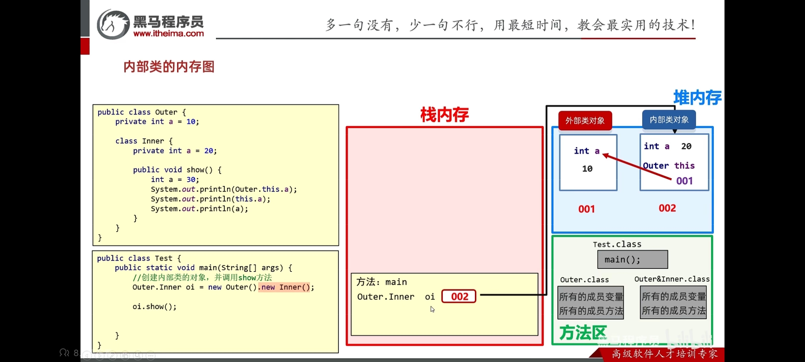

## 内部类

将一个类A定义在另一个类B里面，里面的那个类A就称为**内部类**，B则称为**外部类**。可以把内部类理解成寄生，外部类理解成宿主。

### 1. 什么时候使用内部类

一个事物内部还有一个独立的事物，内部的事物脱离外部的事物无法独立使用

1. 人里面有一颗心脏。
2. 汽车内部有一个发动机。
3. 为了实现更好的封装性。

```java
public class Car {
    private String carName;
    private String carColor;
    //engineName放在Car类属性中不合适
    class Engine {
        private String engineName;
        private String engineAge;
    }
}
```

---

## 内部类的分类

1. **成员内部类**，类定义在了成员位置 (类中方法外称为成员位置，无static修饰的内部类)
2. **静态内部类**，类定义在了成员位置 (类中方法外称为成员位置，有static修饰的内部类)
3. **局部内部类**，类定义在方法内
4. **匿名内部类**，没有名字的内部类，可以在方法中，也可以在类中方法外。

> 前三种只需要了解，后一种需要重点掌握。

---

### 成员内部类

1. 成员内部类可以被一些修饰符所修饰，比如： `private`，默认，`protected`，`public`，`static`等
2. 在成员内部类里面，`JDK16`之前不能定义静态变量，`JDK16`开始才可以定义静态变量。

获取成员内部类对象

1. 在外部类中编写方法，返回内部类的对象(当内部类为`private`时使用)
2. 直接创建格式: `外部类名.内部类名 对象名 = 外部类对象.new 内部类名();`

:::code-group
```java [Outer]
public class Outer {
    String name;
    //私有class
    private class Inner {
    }
    // 在外部类中编写方法，返回内部类的对象
    public Inner getInstance() {
        return new Inner();
    }
}
```

```java [Test]
public class Test {
    public static void main(String[] args) {
        //1. 创建Outer的对象
        Outer outer = new Outer();
        //2. 调用getInstance方法, 但缺点就是Inner类私有化, 所以无法使用变量接收, 只可以直接使用
        System.out.println(outer.getInstance());//com.littlewang.innerclass.Outer$Inner@7a79be86
        //报错Inner类是私有的
        Outer.Inner instance = outer.getInstance();// [!code error]
    }
}
```
:::

:::code-group
```java [Outer]
public class Outer {
    String name;
    public class Inner {
    }
}
```

```java [创建内部类对象]
public class Test {
    public static void main(String[] args) {
        //外部类名.内部类名 对象名 = 外部类对象.new 内部类名();
        Outer.Inner oi = new Outer().new Inner();

    }
}
```
:::

---

成员内部类访问外部类

```java
public class Outer {
    private int a = 10;

    class Inter {
        private int a = 20;

        public void show() {
            int a = 30;
            
            //访问外部类成员变量
            System.out.println(Outer.this.a);// 10 // [!code highlight]
            System.out.println(this.a);// 20
            System.out.println(a);// 30
        }
    }
}
```

:::details Outer.this
在内部类中, 会额外存储`this`指向外部类


:::

---

### 静态内部类

静态内部类只能访问外部类中的静态变量和静态方法, 如果想要访问非静态的需要创建对象

- 创建静态内部类格式: `外部类名.内部类名 对象名 = new 外部类名.内部类名();`
- 调用非静态的格式: **先创建对象, 用对象调用**
- 调用静态的格式: **外部类名.内部类名.静态方法**

:::code-group
```java [StaticInnerClass]
public class StaticInnerClass {
    private String name;
    static class Inner {
        
        public void show1() {
            //报错: 静态内部类只能访问外部类中的静态变量和静态方法
            System.out.println(name);// [!code error]
            System.out.println("非静态show1");
        }

        public static void show2() {
            System.out.println("静态show2");
        }
    }
}
```

```java [Test]
public class Test {
    public static void main(String[] args) {
        //创建静态内部类对象
        StaticInnerClass.Inner inner = new StaticInnerClass.Inner();
        inner.show1();
        //show2是静态内部类中的静态方法, 这样调用虽然可行, 但不建议
        inner.show2();// [!code --]
        //静态内部类中的静态方法, 这样调用
        StaticInnerClass.Inner.show2();// [!code ++]
    }
}
```
:::

---

### 局部内部类


1. **局部内部类**是定义在**方法中**的类
2. 外界是无法直接使用局部内部类的, 它的作用域仅限于当前方法
3. 该类可以直接访问外部类的成员, 也可以访问方法内的局部变量

局部内部类和局部变量类似, 可以修饰局部变量的, 也可以修饰局部内部类

```java
public class InnerClass {
    int b = 10;
    public void show() {
        int a = 10;
        class Inner {
            String name;
            public void method1() {
                // 该类可以直接访问外部类的成员
                System.out.println(b);
            }
        }

        Inner inner = new Inner();
        inner.name = "wjn";
    }
}
```

---

### 匿名内部类

1. **匿名内部类**是隐藏名字的内部类, Java在编译后会给它一个名字,形式为`外部类$序号`
2. **匿名内部类**必须继承一个父类或实现一个接口
3. 匿名内部类可以写在成员位置, 也可以写在局部位置

---

#### 如何理解匿名内部类

1. 把前面的`class`删掉, 剩余的内容就变成了没有名字的类
2. 这个没有名字的类想要实现`Swim`接口, 就把Swim写在大括号的前面, 表示这个没有名字的类实现了`Swim`接口, 所以需要重写`Swim`接口中的抽象方法
3. 还想要创建这个没有名字的类的对象, 就把`new`关键字写在`Swim`的后面, 表示创建这个没有名字的类的对象

---

##### 匿名内部类实现接口

:::code-group
```java [匿名内部类实现接口]
interface Swim {
    public abstract void swim();
}

public class Test {
    public static void main(String[] args) {
        //new的不是接口, 而是没有名字的类, 也就是括号的内容,
        //匿名内部类的对象
        new Swim() {//new的是空参构造

            @Override
            public void swim() {
                System.out.println("游泳");
            }
            //最后必须加分号
        };
    }
}
```

```java [理解方式]
//括号的内容才是匿名内部类
{

    @Override
    public void swim() {
        System.out.println("游泳");
    }
    
}
//若想要实现接口,则将Swim接口放到括号前面
Swim {

    @Override
    public void swim() {
        System.out.println("游泳");
    }
            
}
//想要创建这个没有名字的类的对象, 就需要new
new Swim() {

    @Override
    public void swim() {
        System.out.println("游泳");
    }
    //分号是必须的          
};
```
:::

---

##### 匿名内部类继承父类

:::code-group
```java [匿名内部类继承父类]
public class Test {
    public static void main(String[] args) {

        new Animal() {

            @Override
            public void eat() {
                System.out.println("吃");
            }
        };
    }
}

abstract class Animal {
    public abstract void eat();
}
```

```java [理解方式]
//1. 括号的内容才是匿名内部类
{

    @Override
    public void eat() {
        System.out.println("吃");
    }
}
//2. 若想要继承父类, 则把父类放到括号前面
Animal {
    //继承了抽象类, 就需要重写抽象方法
    @Override
    public void eat() {
        System.out.println("吃");
    }
}
//想要创建这个没有名字的类的对象, 就需要 new
new Animal() {
    @Override
    public void eat() {
        System.out.println("吃");
    }
}
```
:::

---

##### 使用场景

当一个类只需要使用一次时, 可以使用匿名内部类来简化代码

```java
public class Test {
    public static void main(String[] args) {
        //如果一个类只需要使用一次, 就不需要创建一个类, 而是直接使用匿名内部类
        //让匿名内部类继承Animal类
        method(
                new Animal() {
                    @Override
                    public void eat() {
                        System.out.println("狗吃骨头");
                    }
                }

        );
    }

    public static void method(Animal a) {// Animal a = new 子类(); 多态
        //成员方法: 编译看左边, 运行看右边
        a.eat();
    }
}
```

---

##### 匿名内部类终结

- 格式:

```java
new 父类/接口() {
    //重写父类/接口中的方法
};
```

---

## 初识接口多态

```java
public class Test {
    public static void main(String[] args) {
        //Swim接口的实现类
        //那么可以使用Swim接口类型去接收, 即: 接口多态
        Swim s = new Swim() {
            @Override
            public void swim() {
                System.out.println("游泳");
            }
        };
//        成员方法: 编译看左边, 运行看右边
        s.swim();
    }
}

interface Swim {
    public abstract void swim();
}
```


