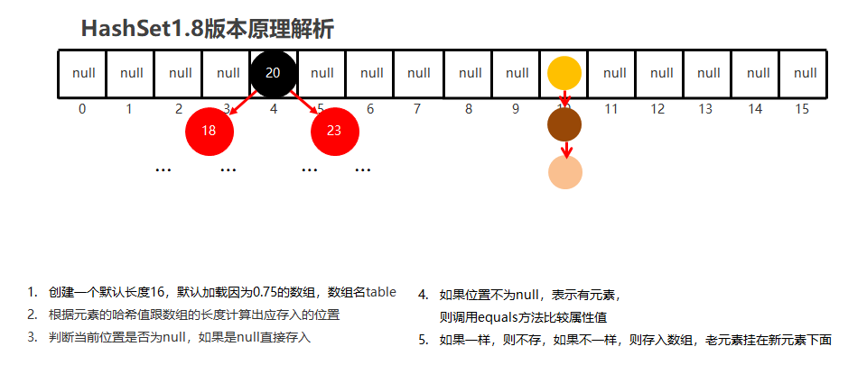

## Collection

`Collection`是一个接口, 无法直接创建对象使用, 需要通过实现类来使用


- `Collection`集合概述

  - 是单例集合的顶层接口,它表示一组对象,这些对象也称为`Collection`的元素
  - `JDK` 不提供此接口的任何直接实现.它提供更具体的子接口(如`Set`和`List`)实现

- 创建`Collection`集合的对象

  - 多态的方式
  - 具体的实现类`ArrayList`

### 基本方法

| 方法名                     | 说明                               |
| :------------------------- | :--------------------------------- |
| boolean add(E e)           | 添加元素                           |
| boolean remove(Object o)   | 从集合中移除指定的元素             |
| boolean removeIf(Object o) | 根据条件进行移除                   |
| void   clear()             | 清空集合中的元素                   |
| boolean contains(Object o) | 判断集合中是否存在指定的元素       |
| boolean isEmpty()          | 判断集合是否为空                   |
| int   size()               | 集合的长度，也就是集合中元素的个数 |


基本使用

```java
import java.util.ArrayList;
import java.util.Collection;

public class Demo1 {
    public static void main(String[] args) {
        //Collection是一个接口,如果想要使用, 就需要实现类配合实现多态的效果才可以使用
        Collection<String> coll = new ArrayList<>();

        coll.add("wang");
        coll.add("jia");
        coll.add("nian");

        coll.remove("jia");

        boolean flag = coll.contains("wang");
        System.out.println(flag);

        coll.clear();
        boolean empty = coll.isEmpty();
        System.out.println(empty);
        System.out.println(coll);
    }
}
```

---

#### `contains`方法的比较方式

在ArrayList集合中, `contains`方法默认情况下, 是根据元素的`equals()`方法进行比较的。

:::details 源码细节
```java
public boolean contains(Object o) {
        return indexOf(o) >= 0;
}

public int indexOf(Object o) {
    return indexOfRange(o, 0, size);
}

int indexOfRange(Object o, int start, int end) {
    Object[] es = elementData;
    if (o == null) {
        for (int i = start; i < end; i++) {
            if (es[i] == null) {
                return i;
            }
        }
    } else {
        for (int i = start; i < end; i++) {
            if (o.equals(es[i])) {// [!code focus]
                return i;
            }
        }
    }
    return -1;
}
```
:::


```java
//Student类没有重写equals()
import java.util.ArrayList;
import java.util.Collection;

public class Demo2 {
    public static void main(String[] args) {

        Collection<Student> list = new ArrayList<>();

        list.add(new Student("zhangsan", 21));
        list.add(new Student("lisi", 25));
        list.add(new Student("wangwu", 30));
        list.add(new Student("zhangsan", 21));

        boolean result = list.contains(new Student("zhangsan", 21));
        //Student类没有重写equals方法, 那么默认使用的就是继承下来的方法, 默认就是比较地址值
        System.out.println(result);// false
    }
}
```

:::tip
`Student`类没有重写equals方法, 那么默认使用的就是继承下来的方法, **默认就是比较地址值**. 重写`equals`方法用于比较属性值
:::

---

### Collection的遍历方式

#### 迭代器

迭代器常用方法:

| 方法名              | 说明                                       |
| :------------------ | :----------------------------------------- |
| `boolean hasNext()` | 判断集合中是否还有元素可以取出             |
| `E next()`          | 返回指针指向的元素，并且指针指向下一个元素 |
| `void remove()`     | 删除指针指向的元素，并且指针指向下一个元素 |

```java
import java.util.ArrayList;
import java.util.Collection;
import java.util.Iterator;

public class Demo1 {
    public static void main(String[] args) {
        // 创建一个存储字符串的集合
        Collection<String> coll = new ArrayList<>();
        // 向集合中添加三个字符串
        coll.add("hello");
        coll.add("world");
        coll.add("java");

        // 创建一个迭代器，用于遍历集合
        Iterator<String> it = coll.iterator();
        // 遍历集合中的每个元素
        while (it.hasNext()) {
            // 获取指针指向的元素, 并且移动指针指向下一个元素
            String str = it.next();
            // 输出当前元素
            System.out.println(str);
        }
        //1. 报错NoSuchElementException
        it.next();// [!code --]

        System.out.println("-------------------");
        //如果需要第二次遍历集合的元素, 就需要获取一个新的遍历器对象
        Iterator<String> it2 = coll.iterator();
        while (it.hasNext()) {
            if("333".equals(it.next())) {
                it.remove();// [!code highlight]
            }
        }
    }
}

```

:::tip
1. 迭代器遍历集合时, 指针所指向的位置越界, 还强制访问会报错`NoSuchElementException`
2. 迭代器遍历完毕后, 指针不会复位, 如果想要再次遍历就需要重新获取迭代器对象
3. 循环中只使用一次`next()`, 如果集合数量是奇数, 那么多次使用会报错`NoSuchElementException`, 导致越界访问
4. 迭代器遍历时, **不能使用集合的方法**进行增加和删除
:::

---

#### 增强for循环

- 增强`for`底层就是迭代器, 为了简化迭代器的书写
- `JDK5`之后出现, 其内部就是一个迭代器
- 所有的单列集合和数组才能用增强`for`循环

格式: `for(集合/数组的数据类型 变量名 : 集合/数组名) {}`

```java
import java.util.ArrayList;
import java.util.Collection;

public class Demo3 {
    public static void main(String[] args) {
        Collection<String> coll = new ArrayList<>();

        coll.add("111");
        coll.add("222");
        coll.add("333");
        coll.add("444");
        coll.add("555");
        //str相当于一个第三方变量, 在循环的过程中依次表示每一个数据
        for(String str: coll) {
            System.out.println(str);
        }
    }
}
```

:::tip
可使用`集合.for`快捷键一件生成循环代码
:::

---

#### Lambda表达式遍历

| 方法名                                             | 说明                             |
| :------------------------------------------------- | :------------------------------- |
| `default void forEach(Consumer<? super E> action)` | 对集合中的每个元素执行指定的操作 |


注: `Consumer`是一个函数式接口

[函数式接口介绍](./lambda表达式.md#基本介绍)

```java
public class Demo3 {
    public static void main(String[] args) {
        Collection<String> coll = new ArrayList<>();
        coll.add("111");
        coll.add("222");
        coll.add("333");
        coll.add("444");
        coll.add("555");
        //1. 使用匿名内部类
        coll.forEach(new Consumer<String>() {
            //s依次表示集合中的每一个数据
            @Override
            public void accept(String s) {
                System.out.println(s);
            }
        });
        //Lambda表达式
        coll.forEach((String s) -> {
            System.out.println(s)
        });
        //Lambda表达式删减版, 类型可以省略, 只有一个参数小括号可以省略, 只能一句话{}可以省略
        coll.forEach(s -> System.out.println(s));

    }
}

```

---

## List集合

List集合是Collection的一种. 所以Collection中的方法`List`都继承下来了

1. 有序
2. 有索引
3. 可重复

---

### 基本方法

| 方法名                           | 说明 |
| :------------------------------- | :--- |
| `void add(int index, E element)` | 增   |
| `E remove(int index)`            | 删   |
| `E get(int index)`               | 改   |
| `E set(int index, E element)`    | 查   |


```java
public class A01_ListDemo1 {
    public static void main(String[] args) {
        /*
        * void add(int index, E element)	增
        E remove(int index)	删
        E get(int index)	改
        E set(int index, E element)	查
        * */
        List<String> list = new ArrayList<>();
        list.add(0, "aaa");
        list.add(1, "bbb");
        list.add(2, "ccc");
        System.out.println(list);// [aaa, bbb, ccc]
        //元素添加到指定的索引处, 索引位置之后的元素都向后移动一位
        list.add(1, "ddd");
        System.out.println(list);// [aaa, ddd, bbb, ccc]
        list.remove(2);

        String str = list.get(1);
        System.out.println(str);
        list.set(1, "wjn");

    }
}
```

---

### 遍历方式

在包含之前四种遍历(迭代器, 增强for, Lambda, 普通遍历)的情况下, 新增的列表迭代器

#### 列表迭代器

| 方法名                  | 说明                                                           |
| :---------------------- | :------------------------------------------------------------- |
| `void add(E e)`         | 在列表中的指定位置上添加元素, 索引位置之后的元素都向后移动一位 |
| `boolean hasNext()`     | 继承自Collection                                               |
| `E next()`              | 继承自Collection                                               |
| `void remove()`         | 继承自Collection                                               |
| `void set(E e)`         | 替换当前元素                                                   |
| `boolean hasPrevious()` | 判断是否还有上一元素(了解)                                     |
| `E previous()`          | 返回上一元素, 并且指针向前移动一位(了解)                       |
| `int nextIndex()`       | 返回下一个元素的索引(了解)                                     |
| `int previousIndex()`   | 返回上一个元素的索引(了解)                                     |


```java
public class A02_ListDemo2 {
    public static void main(String[] args) {
        List<String> list = new ArrayList<>();

        list.add("aaa");
        list.add("bbb");
        list.add("ccc");

        ListIterator<String> it = list.listIterator();
        while (it.hasNext()) {
            String str = it.next();
            if("bbb".equals(str)) {
                //迭代器遍历时, 不能使用集合的方法进行增加和删除, 不然报错ConcurrentModificationException
//                list.add("qqq");
                //但可以使用迭代器本身的方法去添加
                it.add("qqq");
            }
        }
        System.out.println(list);

    }
}
```

---

## Set集合

- 无序: 存取的顺序不一致
- 不可重复
- 无索引

实现类

- `HashSet`: 无序, 不重复, 无索引
- `LinkedHashSet`: 有序, 不重复, 无索引
- `TreeSet`: 可排序, 不重复, 无索引

> `Set`集合API基本与[Collection](#collection)一致

---

### 遍历方式

可使用迭代器, 增强for, Lambda

```java
public class Demo1 {
    public static void main(String[] args) {
        //多态
        Set<String> set = new HashSet<>();
        System.out.println(set.add("hello"));
        System.out.println(set.add("hello"));
        set.add("world");
        //无序
        System.out.println(set);//[world, hello]
        //遍历方式: 迭代器
        Iterator<String> it = set.iterator();
        while (it.hasNext()) {
            String str = it.next();
            System.out.println(str);
        }
        //遍历方式: 增强for循环
        for (String str : set) {
            System.out.println(str);
        }
        //遍历方式: 匿名内部类
        set.forEach(new Consumer<String>() {
            @Override
            public void accept(String s) {
                System.out.println(s);
            }
        });

        //遍历方式: lambda表达式
        set.forEach(str -> System.out.println(str));
    }
}
```

---

### HashSet

- `HashSet`: 无序, 不重复, 无索引
- `HashSet`在`JDk8`以前底层使用了数组, 链表
- 在JDK8以后, 使用了数组, 链表, 红黑树

元素存储位置的计算公式为: `int index = (数组长度 - 1) & 哈希值`

- 哈希值就是通过`hashCode()`方法计算得来的int类型的整数
- 该方法定义在`Object`类中, **默认使用地址值进行计算**
- 一般情况下, 会重写`hashCode()`方法, 利用对象内部属性计算哈希值

```java
@Override
public boolean equals(Object o) {
    if (this == o) return true;
    if (o == null || getClass() != o.getClass()) return false;
    Student student = (Student) o;
    return age == student.age && Objects.equals(name, student.name);
}
//重写hashCode()方法
@Override
public int hashCode() {
    return Objects.hash(name, age);
}
```

:::info
idea中直接使用快捷键就行, 不需要直接写
:::

---

对象的哈希值特点:

1. 如果没有重写`hashCode()`方法, 不同的对象计算出的哈希值是不同的
2. 重写了`hashCode()`方法, 不同的对象只要属性值相同, 计算出的哈希值就相同
3. 在小部分情况下, 不同的属性值或者不同的地址值计算出来的哈希值有可能相同(哈希碰撞)

```java
//解释3
public class Demo2 {
    public static void main(String[] args) {
        //String类内部重写了hashCode()方法, 而下面两字符串恰好计算出的哈希值相同
        System.out.println("abc".hashCode());// 96354
        System.out.println("acD".hashCode());// 96354
    }
}
```

---

#### HashSet的底层实现原理




:::tip
如果对象使用`HashSet`不重写`equals`和`hashCode`方法, 那么就默认使用地址值计算出来的哈希值进行判断HashSet是否存在重复的元素, 这时即便属性值一致, 但地址值不一致, 也会被认为是不同的对象, 进而存储到HashSet中.
:::

---

没有重写equals和hashCode方法时

```java
//没有重写equals和hashCode方法时
public class Demo3 {
    public static void main(String[] args) {
        HashSet<Student> set = new HashSet<>();
        set.add(new Student("张三", 18));
        set.add(new Student("张三", 18));
        set.add(new Student("李四", 19));
        set.add(new Student("王五", 20));
        System.out.println(set);

    }
}
```

:::tip
- 没有重写的输出: `[Student{name = 王五, age = 20}, Student{name = 张三, age = 18}, Student{name = 张三, age = 18}, Student{name = 李四, age = 19}]`
- 重写后的输出: `[Student{name = 张三, age = 18}, Student{name = 王五, age = 20}, Student{name = 李四, age = 19}]`
:::

---

### LinkedHashSet


- `LinkedHashSet`: 有序, 不重复, 无索引
- 原理: 底层数据结构依旧使用哈希表, 只有又额外的多了一个**双链表**的机制记录存储的顺序.

```java
public class Demo4 {
    public static void main(String[] args) {
        LinkedHashSet<String> lhs = new LinkedHashSet<>();
        lhs.add("a");
        lhs.add("b");
        lhs.add("c");
        lhs.add("d");

        System.out.println(lhs);
        //[a, b, c, d] --- 取出时是有序的

    }
}
```

---

### TreeSet

- 底层数据结构是红黑树
- `TreeSet`: 可排序, 不重复, 无索引

```java
//遍历方式
public class Demo5 {
    public static void main(String[] args) {
        TreeSet<Integer> ts = new TreeSet<Integer>();
        ts.add(5);
        ts.add(3);
        ts.add(1);
        ts.add(4);
        ts.add(2);

        System.out.println(ts);
        //[1, 2, 3, 4, 5]
        //遍历方式
        Iterator<Integer> it = ts.iterator();
        while (it.hasNext()) {
            Integer i = it.next();
            System.out.println(i);
        }
        System.out.println("-------------------");
        for (Integer i : ts) {
            System.out.println(i);
        }
        System.out.println("-------------------");
        ts.forEach(i -> System.out.println(i));
    }
}
```

---

#### TreeSet的排序规则

- 数值类型: `Integer`, `Double`, 默认按照从小到大的顺序进行排序
- 字符, 字符串类型: 按照字符的`ASCII`码值进行排序

:::code-group
```java [字符串类型比较]
public class Demo1 {
    public static void main(String[] args) {
        TreeSet<String> ts = new TreeSet<>();

        ts.add("aa");
        ts.add("ab");
        ts.add("abb");
        System.out.println(ts);
        //输出结果: [aa, ab, abb]
    }
}
```

```java [数值类型比较]
public class Demo5 {
    public static void main(String[] args) {
        TreeSet<Integer> ts = new TreeSet<Integer>();
        ts.add(5);
        ts.add(3);
        ts.add(1);
        ts.add(4);
        ts.add(2);

        System.out.println(ts);
        //[1, 2, 3, 4, 5]
        //遍历方式
        Iterator<Integer> it = ts.iterator();
        while (it.hasNext()) {
            Integer i = it.next();
            System.out.println(i);
        }
        System.out.println("-------------------");
        for (Integer i : ts) {
            System.out.println(i);
        }
        System.out.println("-------------------");
        ts.forEach(i -> System.out.println(i));
    }
}

```
:::

:::tip 举例
1. `aa`与`ab`, 两者第一位都是`a`, 那么则会比较第二位, 而第二位`a < b`, 则`ab`大排在后面
2. `aa`与`aab`, 两者前二位相同, 而到第三位的时候, 字符串1后面没有了, 那么默认按照`aab`大排在后面

总结: 字符与字符串的比较方式, 是两个字符按照`ASCII`码值从左到右一一比较, 相等则两者都向右移动一位
:::

---

#### 对象类型作为TreeSet的泛型

```java
public class Demo1 {
    public static void main(String[] args) {

        Student s1 = new Student("zhangsan", 23);
        Student s2 = new Student("lisi", 24);
        Student s3 = new Student("wanwu", 25);

        TreeSet<Student> ts = new TreeSet<>();
        ts.add(s1);// [!code error]
        ts.add(s2);
        ts.add(s3);
        System.out.println(ts);
    }
}
```

:::danger 最终会报错
`Exception in thread "main" java.lang.ClassCastException: class knowSet.Student cannot be cast to class java.lang.Comparable`

`TreeSet`的泛型类型必须是实现`Comparable`接口的类, 因为自定义对象类型并没有比较大小的规则, 所以对此我们需要实现`Comparable`接口
:::

#### 比较方式1实现`Comparable`接口

:::code-group
```java [实现接口形式一]
//Comparable<E>, 中的E指的是要比较的是谁, 同时也对应着compareTo的第一个参数类型
public class Student implements Comparable<Student> {

    @Override
    public int compareTo(Student o) {
        return 0;
    }
}
```

```java [实现接口形式二]
public class Student<E> implements Comparable<E> {
    @Override
    public int compareTo(E o) {
        return 0;
    }
}
```
:::

:::tip
如果已经知道要比较的对象类型，那么可以直接使用**形式一**; 反之使用**形式二**
:::

:::code-group
```java [javabean类]
//javabean类
public class Student implements Comparable<Student> {
    private String name;
    private int age;

    public Student() {
    }

    public Student(String name, int age) {
        this.name = name;
        this.age = age;
    }

    /* getter setter */

    public String toString() {
        return "Student{name = " + name + ", age = " + age + "}";
    }

    @Override
    public int compareTo(Student o) {
        //this: 当前需要添加的元素
        //o: 已经添加到红黑树中的元素
        //返回值规则
        //返回负数: 认为要添加的元素是小的, 存左边
        //正数: 认为哟添加的元素是大的, 存右边
        //0: 认为要添加的元素已经存在, 舍弃
        int result = this.getAge() - o.getAge();
        return result;
    }
}
```

```java [测试]
public class Demo1 {
    public static void main(String[] args) {

        Student s1 = new Student("zhangsan", 23);
        Student s2 = new Student("lisi", 24);
        Student s3 = new Student("wanwu", 25);
        Student s4 = new Student("zhaoliu", 26);

        TreeSet<Student> ts = new TreeSet<>();
        ts.add(s1);
        ts.add(s2);
        ts.add(s3);
        ts.add(s4);
        System.out.println(ts);
        //返回结果: [Student{name = zhangsan, age = 23}, Student{name = lisi, age = 24}, Student{name = wanwu, age = 25}, Student{name = zhaoliu, age = 26}]
    }
}
```
:::

:::tip 提示
- `this`: 当前需要添加的元素
- `o`: 已经添加到红黑树中的元素
- 返回值规则
  - **返回负数**: 认为要添加的元素是小的, 存左边
  - **正数**: 认为哟添加的元素是大的, 存右边
  - **0**: 认为要添加的元素已经存在, 舍弃
- 第一次调用`compareTo()`是当前元素与自己去比较, 自己与自己比较, 那么返回值一定是`0`, 这时集合中没有元素, 因此会添加. 这时一个例外, 与返回值的第三条规则不同.
:::

---

#### 比较方式2比较器

比较器的使用需要提及到`TreeSet`的二个构造方式`TreeSet(Comparator<? super E> comparator)`, 而`Comparator`是一个[函数式接口](./lambda表达式.md)

```java 
public class Demo2 {
    public static void main(String[] args) {
        //需求1: 字符串按照长度排序, 如果一样长则按照字母排序
        TreeSet<String> ts = new TreeSet<>(new Comparator<String>() {
            @Override
            public int compare(String o1, String o2) {
                //o1:  当前需要添加的元素
                //o2: 已经添加到集合中的元素
                int result = o1.length() - o2.length();
                //如果长度一致按照原来字符串的排序形式(String内部已经实现了Comparable接口也重写了compareTo方法)排序, 否则先按照长度进行排序
                return result == 0 ? o1.compareTo(o2) : result;
            }
        });

        // 也可以使用lambda表达式
        /*
                TreeSet<String> ts = new TreeSet<>((o1, o2) -> {
                //o1:  当前需要添加的元素
                //o2: 已经添加到集合中的元素
                int result = o1.length() - o2.length();
                //如果长度一致按照原来字符串的排序形式(String内部已经实现了Comparable接口也重写了compareTo方法)排序, 否则先按照长度进行排序
                return result == 0 ? o1.compareTo(o2) : result;

        });
        */
        
        ts.add("123");
        ts.add("1234");
        ts.add("123456");
        ts.add("1235");
        System.out.println(ts);
        //输出结果为: [123, 1234, 1235, 123456]
    }
}
```

:::tip 如何选择比较方式
首选第一种比较方式, 如果第一种比较方式不可以满足我们的需要就使用第二种

不满足的情况例如: 字符串的排序规则Java已经帮我们写好了, 如果我想要按照长度排序, 我不可能去手动更改源码. 而且String类是
[最终类](./final.md)无法继承, 若不使用比较器`Comparator`, 就无计可施了.

如果比较方式一和比较方式二都存在, 则以方式二为准. 例如, `String`类已经在内部定义好了比较规则, 而我们定义了`Comparator`比较对象, 最终是按照`Comparator`比较规则排序.
:::

---

## 总结集合使用场景

1. 如果想要集合中的元素可重复, 则使用`ArrayList`
2. 如果想要集合中的元素可重复, 而且当前的增删操作明显多于查询操作, 则使用`LinkedList`
3. 如果想要集合中的元素不可重复, 则使用`HashSet`
4. 如果想要集合中的元素不可重复, 而且保证存取顺序, 则使用`LinkedHashSet`
5. 想要集合中的元素不可重复, 且保证存取顺序, 且保证元素按照某种规则排序, 则使用`TreeSet`

---

<script setup>
import Test from '../components/test.vue'
</script>


<Test />